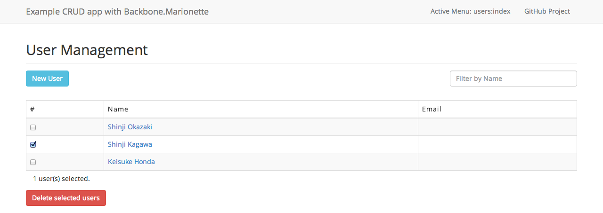

# Backbone.Marionette Example

MVVM-flavored example CRUD app with [Backbone.Marionette](https://github.com/marionettejs/backbone.marionette) + [Backbone.stickit](http://nytimes.github.io/backbone.stickit/) + [Browserify](http://browserify.org/).



Code here is **work in progress**.

## Development

```
$ git clone https://github.com/monzou/backbone.marionette.example.git
$ cd backbone.marionette.example
$ npm install
$ bower install
$ grunt
```
